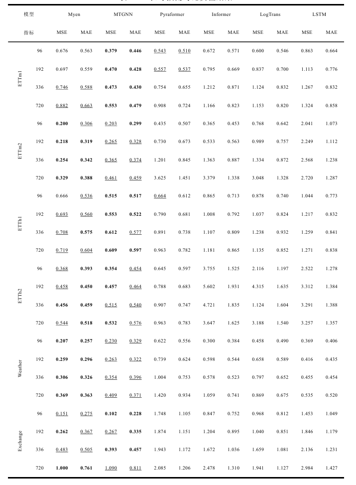

# GNN4MSTF
## Model architecture

## ST-GCRN

# Requirements
```
pip install -r requirements.txt
```
# Dataset
<div style="display: flex; flex-direction: column; align-items: center;">
    
    
</div>

# Comparative Experiment
## Long term forecast
The baseline result get from the paper: [TimesNet](https://arxiv.org/abs/2210.02186). The ```models``` contains the realative paper's model in this fields.

See ```scripts/long_term_forecast/comparative.md``` to get all scripts.
### Result

## Short term forecast
# Ablation Study
## Long term forecast
### Optional
- `is_training`: 1/0
- `model_id`:
    - HHAGCRN_96_96,HHAGCRN_96_192, HHAGCRN_96_336,HHAGCRN_96_720
    - HHAGCRNwithoutAGL_96_96,HHAGCRNwithoutAGL_96_192,HHAGCRNwithoutAGL_96_336,HHAGCRNwithoutAGL_96_720
    - HHAGCRNwithoutNPW_96_96,HHAGCRNwithoutNPW_96_192,HHAGCRNwithoutNPW_96_336,HHAGCRNwithoutNPW_96_720
    - HHAGCRNwithoutHiPPO_96_96,HHAGCRNwithoutHiPPO_96_192,HHAGCRNwithoutHiPPO_96_336,HHAGCRNwithoutHiPPO_96_720
- `seq_len`: 96
- `pred_len`: 96, 192, 336, 720

See ```scripts/long_term_forecast/ablation.md``` to get all scripts
### Result

## Short term forecast

# Visual
Long term forecast visual pdf save in the test process,see the relative result.

To get the short term forecast visual pdf and heat_map,see and run ```All_result/visual.ipynb```.
## Example
<div style="display: flex; justify-content: center;">
    
    
</div>

<div style="display: flex; justify-content: center;">
    
    
</div>

<div style="display: flex; justify-content: center;">
    
    
</div>
