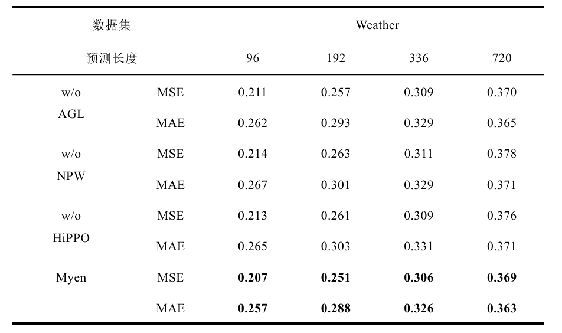

# GNN4MSTF
## Model architecture

## ST-GCRN

# Requirements
With the pytorch and NVIDIA RTX 4090 GPU
```
pip install -r requirements.txt
```
# Dataset
The long term forecast dataset can get from [Time-Series-Library](https://github.com/thuml/Time-Series-Library).

The short term forecast dataset can get from [DCRNN](https://github.com/liyaguang/DCRNN).
<div style="display: flex; flex-direction: column; align-items: center;">
    
    
</div>

# Comparative Experiment
## Long term forecast
The baseline result get from the paper: [TimesNet](https://arxiv.org/abs/2210.02186). The ```Long_term_forecast/models``` contains the realative paper's model in this fields.

See ```scripts/long_term_forecast/comparative.md``` to get all scripts.
### Result

## Short term forecast
### Result
The baseline result get from own model paper.

See ```scripts/short_term_forecast/comparative.md``` to get all scripts.
<div style="display: flex; flex-direction: row; align-items: center; gap: 20px;">
    
    
</div>

# Ablation Study
## Long term forecast
### Optional
- HHAGCRNwithoutAGL:
    replace the adaptive learning graph with the fully connect graph.

    key code:```adj_new = torch.ones((node_num, node_num)).to(x.device)```
- HHAGCRNwithoutNPW:
    replace the node pattern weights poll with the traditional weights martix.

    key code:```x_gconv = torch.einsum('bnki,kio->bno', x_g, self.weights_pool) + self.bias_pool```
- HHAGCRNwithoutHiPPO:
    replace the hippo gru unit with the tradiontial gru unit.

    key code:```# c=self.meomory(c,f,t)```

See ```scripts/long_term_forecast/ablation.md``` to get all scripts
### Result

## Short term forecast
### Optional
- HHAGCRNwithoutAGL:
    replace the adaptive learning graph with the fully connect graph.

    key code:```adj=torch.ones(self.num_nodes, self.num_nodes).to(device)```
- HHAGCRNwithoutGCN:
    replace the graph convolution network with the traditional mlp.

    key code:```c=fn(inputs, adj_mx, r * hx, self._num_units)```

See ```scripts/short_term_forecast/ablation.md``` to get all scripts
### Result

# Visual
Long term forecast visual pdf save in the test process,see the relative result.

To get the short term forecast visual pdf and heat_map,see and run ```All_result/visual.ipynb```.
## Example
<div style="display: flex; justify-content: center;">
    
    
</div>

<div style="display: flex; justify-content: center;">
    
    
</div>

<div style="display: flex; justify-content: center;">
    
    
</div>
